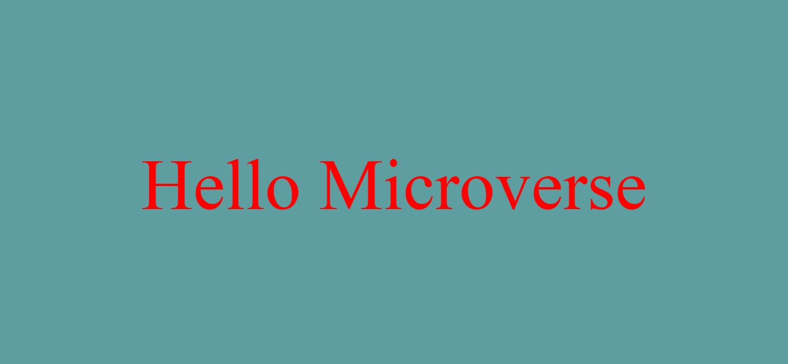

# Hello-Microvese

- First Html project in Microverse.

## Screen Shot

Additional description about the project and its features.

## Built With

- Html
- Css
- Vscode
- linters

## Live Demo

[Live Demo Link](https://raw.githack.com/mbdesigns1989/Hello-World-2/feature-branch/A.html)

## Getting Started

**This is an example of how you may give instructions on setting up your project locally.**
**Modify this file to match your project, remove sections that don't apply. For example: delete the testing section if the currect project doesn't require testing.**

To get a local copy up and running follow these simple example steps.

### Prerequisites

### Setup

### Install

### Usage

### Run tests

### Deployment

## Authors

👤 **Author1**

- GitHub: [@mbdesigns1989](https://github.com/mbdesigns1989)

## 🤝 Contributing

Contributions, issues, and feature requests are welcome!

Feel free to check the [issues page](../../issues/).

## Show your support

Give a ⭐️ if you like this project!

## Acknowledgments

- Hat tip to anyone whose code was used
- Inspiration
- etc

## 📝 License

This project is [MIT](./MIT.md) licensed.
